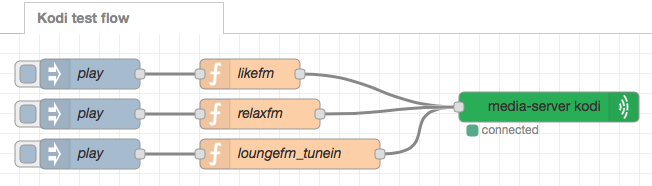
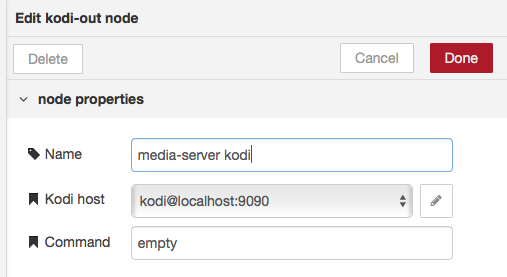
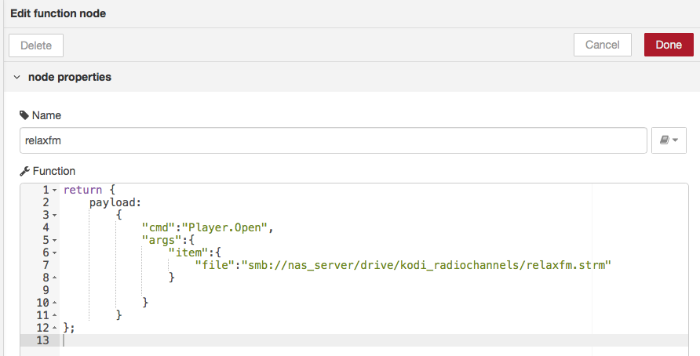

node-red-contrib-kodi
========================

A <a href="http://nodered.org" target="_new">Node-RED</a> node to communicate [Kodi](https://kodi.tv) over [JSON RPC API](https://kodi.wiki/view/JSON-RPC_API).

Install
-------

Run command on Node-RED installation directory

    npm install node-red-contrib-kodi

Contains
--------

* **Kodi** config node to configure connection
* **Kodi-in** node to send command packets: https://kodi.wiki/view/JSON-RPC_API/v9#Methods
* **Kodi-out** node to receive events (notifications) from Kodi app: https://kodi.wiki/view/JSON-RPC_API/v9#Notifications_2 

Usage
-----

Flow example
-----

    [{"id":"8b700bf3.89959","type":"function","z":"aa6ac7a3.4e725","name":"likefm","func":"return {\n    payload: \n        {\n            \"cmd\":\"Player.Open\",\n            \"args\":{\n                \"item\":{\n                    \"file\":\"smb://CUBIE/boba_500gb/kodi_radiochannels/likefm.strm\"   \n                }\n                \n            }\n        }\n};","outputs":1,"noerr":0,"x":250,"y":40,"wires":[["756a3111.3ef23"]]},{"id":"c8fafa38.b2b3b8","type":"function","z":"aa6ac7a3.4e725","name":"loungefm_tunein","func":"return {\n    payload: \n        {\n            \"cmd\":\"Player.Open\",\n            \"args\":{\n                \"item\":{\n                    \"file\": \"plugin://plugin.audio.tuneinradio/?logo=http%3A%2F%2Fcdn-radiotime-logos.tunein.com%2Fs206479q.png&path=tune&id=s206479&name=Lounge+FM+Terrace+%28%29\"\n                }\n                \n            }\n        }\n};","outputs":1,"noerr":0,"x":290,"y":120,"wires":[["756a3111.3ef23"]]},{"id":"cfdf0958.95ed88","type":"function","z":"aa6ac7a3.4e725","name":"relaxfm","func":"return {\n    payload: \n        {\n            \"cmd\":\"Player.Open\",\n            \"args\":{\n                \"item\":{\n                    \"file\":\"smb://nas_server/drive/kodi_radiochannels/relaxfm.strm\"\n                }\n                \n            }\n        }\n};\n","outputs":1,"noerr":0,"x":260,"y":80,"wires":[["756a3111.3ef23"]]},{"id":"756a3111.3ef23","type":"kodi-out","z":"aa6ac7a3.4e725","name":"media-server kodi","controller":"273fb093.8b7fa8","unit_number":"1","output":"1","kodicommand":"empty","x":548.9444580078125,"y":73,"wires":[]},{"id":"beadf12f.ef8c98","type":"inject","z":"aa6ac7a3.4e725","name":"play","topic":"","payload":"","payloadType":"date","repeat":"","crontab":"","once":false,"onceDelay":0.1,"x":90,"y":40,"wires":[["8b700bf3.89959"]]},{"id":"cd3e940a.fd6a38","type":"inject","z":"aa6ac7a3.4e725","name":"play","topic":"","payload":"","payloadType":"date","repeat":"","crontab":"","once":false,"onceDelay":0.1,"x":90,"y":80,"wires":[["cfdf0958.95ed88"]]},{"id":"c17e3469.a12588","type":"inject","z":"aa6ac7a3.4e725","name":"play","topic":"","payload":"","payloadType":"date","repeat":"","crontab":"","once":false,"onceDelay":0.1,"x":90,"y":120,"wires":[["c8fafa38.b2b3b8"]]},{"id":"62b1358c.4534b4","type":"kodi-in","z":"aa6ac7a3.4e725","name":"","controller":"273fb093.8b7fa8","x":260,"y":320,"wires":[["8acab3a.421b15"]]},{"id":"8acab3a.421b15","type":"debug","z":"aa6ac7a3.4e725","name":"","active":true,"tosidebar":true,"console":false,"tostatus":false,"complete":"true","x":460,"y":320,"wires":[]},{"id":"632c49cb.7a5298","type":"function","z":"aa6ac7a3.4e725","name":"loungefm_tunein","func":"return {\n    payload: \n        {\n            \"cmd\":\"Player.Open\",\n            \"args\":{\n                \"item\":{\n                    \"file\": \"plugin://plugin.audio.tuneinradio/?path=tune&id=s53084\"\n                }\n                \n            }\n        }\n};","outputs":1,"noerr":0,"x":290,"y":200,"wires":[["756a3111.3ef23"]]},{"id":"881beefe.dfc868","type":"inject","z":"aa6ac7a3.4e725","name":"play","topic":"","payload":"","payloadType":"date","repeat":"","crontab":"","once":false,"onceDelay":0.1,"x":90,"y":200,"wires":[["632c49cb.7a5298"]]},{"id":"273fb093.8b7fa8","type":"kodi-controller","z":"","name":"kodi","host":"localhost","port":"9090"}]